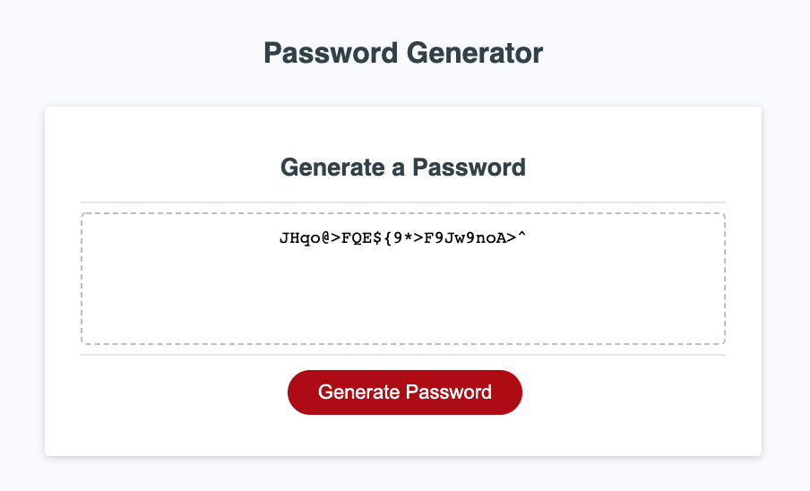

# Password Generator

## A website to help you create unique passwords! 

Deployed Application: https://ellysecarter.github.io/specialcharacter/

## Table of Contents 

* [Description](#description)
* [Technologies used](#technologies-used)
* [Installation](#installation)
* [Known bugs](#known-bugs)
* [Contact](#contact)

## Description

Use this website to make unique passwords for you. Start by clicking the "Generate Password" button. First you choose between 8 and 128 characters, then you can select to use uppercase, lowercase, numeric, or special characters. After that, the system creates their unique password and displays it on the screen as well as shows it in the console.

## Technologies Used
* HTML
* CSS
* JavaScript

## Installation

Go to https://github.com/ellysecarter/specialcharacter and clone the repo with either your SSH key or with HTTPS. Next, go to the terminal on your computer and type in "git clone" and paste the key. After that, open the application in your VS code or another code application that you use. 

You can also go straight to the deployed application here: https://ellysecarter.github.io/specialcharacter/

## Known Bugs
none 

## Contact 

If you have any questions or would like to contribute to this project please reach out to me at ellysecarter@yahoo.com or [@ellysecarter](https://github.com/ellysecarter)
